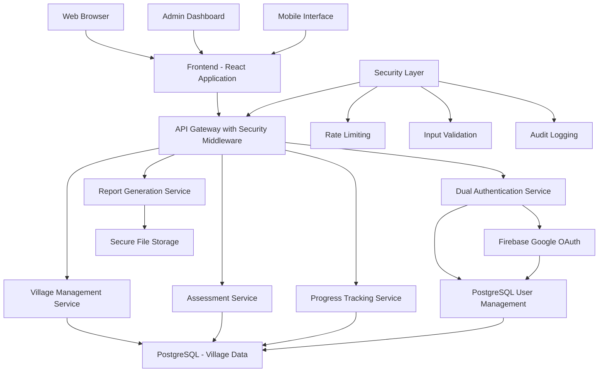
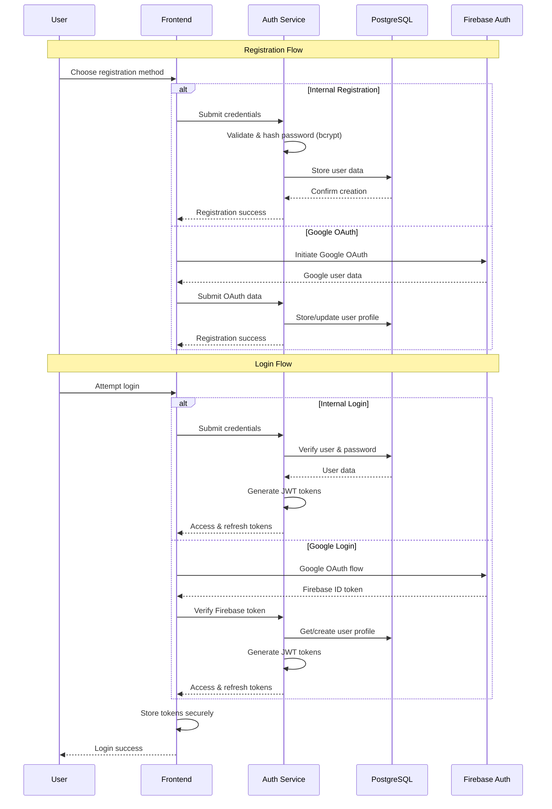
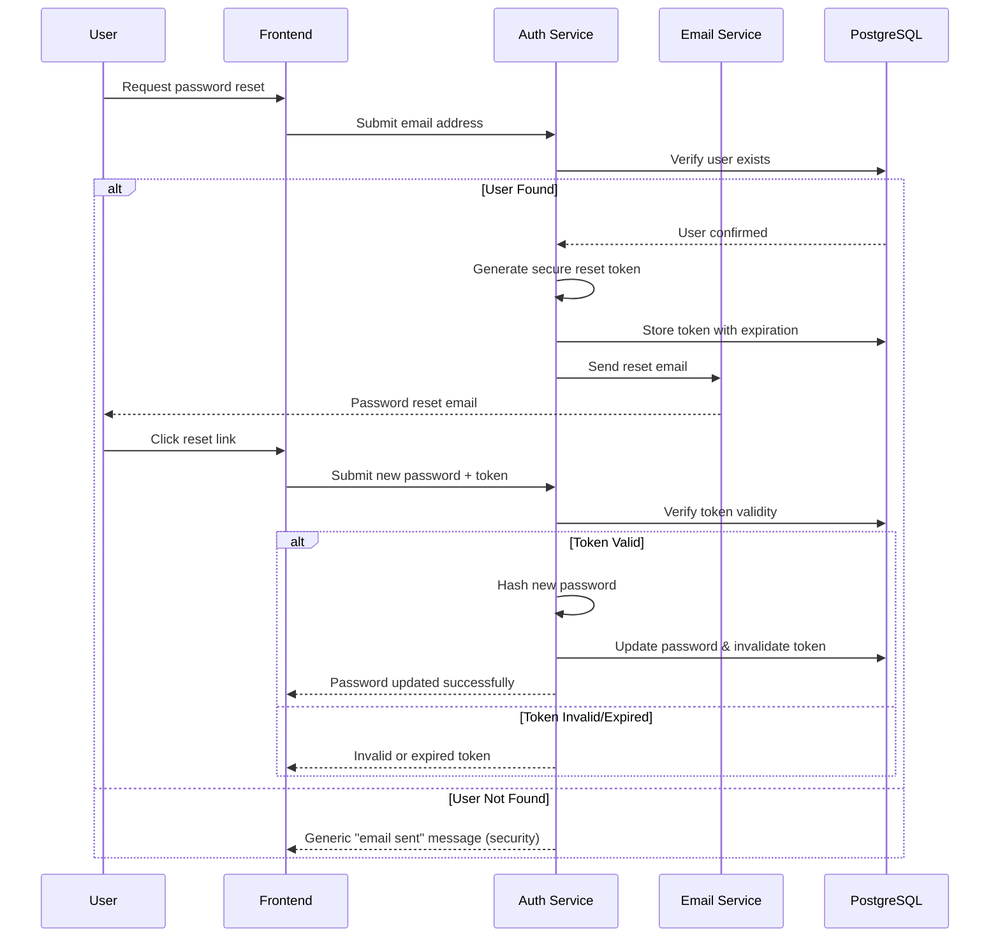

# Design Document

## Overview

The Adarsh Gram Gap Assessment System is a web-based application designed to systematically identify infrastructure and service gaps in SC-majority villages under the PM-AJAY program. The system features a monochromatic user interface and provides comprehensive tools for village management, gap assessment, progress tracking, and reporting.

## Architecture

### System Architecture



### Technology Stack

- **Frontend**: React.js with TypeScript for type safety
- **Backend**: Node.js with Express.js framework
- **Database**: PostgreSQL for relational data storage and user management
- **Authentication**: 
  - PostgreSQL for internal user accounts and role management
  - Firebase Authentication for Google OAuth and social login
  - JWT tokens for session management
- **File Storage**: AWS S3 or local file system for documents and images
- **API**: RESTful API design with OpenAPI documentation
- **Styling**: Tailwind CSS for monochromatic design implementation
- **Security**: bcrypt for password hashing, helmet.js for security headers

## Components and Interfaces

### 1. Village Profile Manager

**Purpose**: Manages village registration, demographic data, and eligibility tracking.

**Key Features**:
- Village registration with comprehensive demographic forms
- SC population percentage calculation and eligibility determination
- Geographic mapping integration for village location
- Bulk import capabilities for existing village data
- Advanced search and filtering functionality

**Interface Design**:
- Clean form layouts with black borders and white backgrounds
- Tabular data display with alternating gray row highlighting
- Modal dialogs for detailed village information
- Responsive grid layout for village cards

### 2. Assessment Module

**Purpose**: Conducts systematic infrastructure gap assessments across all focus areas.

**Key Features**:
- Multi-step assessment wizard for each focus area
- Standardized scoring rubrics with predefined benchmarks
- Photo upload and document attachment capabilities
- Real-time gap score calculation
- Assessment history and comparison tools

**Interface Design**:
- Progress indicators showing assessment completion status
- Accordion-style sections for each focus area
- Rating scales with clear visual indicators
- File upload areas with drag-and-drop functionality

### 3. Progress Tracker

**Purpose**: Monitors development project progress and completion status.

**Key Features**:
- Project timeline visualization
- Milestone tracking with percentage completion
- Automated progress calculations
- Alert system for deadline management
- Integration with assessment results

**Interface Design**:
- Gantt chart-style project timelines
- Progress bars with percentage indicators
- Status badges using different shades of gray
- Dashboard widgets for quick overview

### 4. Interactive Dashboard

**Purpose**: Provides a sleek, clean interface for monitoring pending requests and system status.

**Key Features**:
- Real-time pending problem reports with location mapping
- Interactive status cards showing village development progress
- Quick action buttons for common tasks
- Location-based filtering and search
- Notification center for updates and alerts

**Interface Design**:
- Clean card-based layout with subtle shadows and borders
- Interactive elements with hover effects using grayscale transitions
- Responsive grid system adapting to screen sizes
- Minimalist navigation with clear visual hierarchy
- Smooth animations and transitions for user engagement

### 5. Problem Reporting System

**Purpose**: Allows citizens to report infrastructure problems in their villages.

**Key Features**:
- Location-based problem submission with GPS integration
- Category selection for different infrastructure types
- Photo upload with automatic compression
- Status tracking from submission to resolution
- Edit permissions restricted to original reporter and admins

**Interface Design**:
- Step-by-step form wizard with progress indicators
- Map integration for precise location selection
- Drag-and-drop file upload areas
- Status timeline with visual progress markers
- Clean typography with ample white space

### 6. Report Generator

**Purpose**: Creates comprehensive reports and analytics for decision-making.

**Key Features**:
- Standardized report templates
- Comparative analysis across villages
- Export functionality (PDF, Excel, CSV)
- Visual charts and graphs
- Scheduled report generation

**Interface Design**:
- Report preview with print-friendly layouts
- Chart components using grayscale color schemes
- Filter panels for custom report generation
- Download buttons with clear file format indicators

### 5. User Interface Framework

**Purpose**: Provides consistent monochromatic design across all components.

**Design Principles**:
- Exclusive use of black (#000000), white (#FFFFFF), and grayscale colors
- High contrast ratios for accessibility compliance
- Consistent typography with clear hierarchy
- Minimalist design approach with ample white space
- Responsive breakpoints for mobile compatibility

## Data Models

### Village Entity
```typescript
interface Village {
  id: string;
  name: string;
  state: string;
  district: string;
  block: string;
  pincode: string;
  totalPopulation: number;
  scPopulation: number;
  scPercentage: number;
  isEligible: boolean;
  coordinates: {
    latitude: number;
    longitude: number;
  };
  registrationDate: Date;
  lastUpdated: Date;
  status: 'registered' | 'under_assessment' | 'in_development' | 'adarsh_gram';
}
```

### Assessment Entity
```typescript
interface Assessment {
  id: string;
  villageId: string;
  assessorId: string;
  focusArea: 'education' | 'healthcare' | 'sanitation' | 'connectivity' | 
            'drinking_water' | 'electricity' | 'skill_development' | 'livelihood';
  criteria: AssessmentCriteria[];
  overallScore: number;
  gapLevel: 'critical' | 'moderate' | 'minor' | 'adequate';
  recommendations: string[];
  supportingDocuments: string[];
  assessmentDate: Date;
  status: 'draft' | 'completed' | 'reviewed';
}
```

### Project Entity
```typescript
interface Project {
  id: string;
  villageId: string;
  name: string;
  focusArea: string;
  description: string;
  budget: number;
  startDate: Date;
  expectedEndDate: Date;
  actualEndDate?: Date;
  completionPercentage: number;
  milestones: Milestone[];
  status: 'planned' | 'in_progress' | 'completed' | 'delayed';
}
```

### Problem Report Entity
```typescript
interface ProblemReport {
  id: string;
  reporterId: string;
  villageId: string;
  title: string;
  description: string;
  category: 'education' | 'healthcare' | 'sanitation' | 'connectivity' | 
           'drinking_water' | 'electricity' | 'skill_development' | 'livelihood';
  location: {
    latitude: number;
    longitude: number;
    address: string;
  };
  priority: 'low' | 'medium' | 'high' | 'critical';
  status: 'pending' | 'under_review' | 'in_progress' | 'resolved' | 'rejected';
  attachments: string[];
  reportedDate: Date;
  lastUpdated: Date;
  assignedTo?: string;
  resolutionNotes?: string;
  canEdit: boolean; // Computed based on user permissions
}
```

### User Entity (Enhanced)
```typescript
interface User {
  id: string;
  email: string;
  passwordHash?: string; // Only for internal accounts
  firebaseUid?: string; // Only for Google OAuth accounts
  firstName: string;
  lastName: string;
  phoneNumber: string;
  role: 'system_admin' | 'district_admin' | 'block_officer' | 
        'village_reporter' | 'assessor' | 'viewer';
  location: {
    state: string;
    district: string;
    block?: string;
    village?: string;
  };
  isActive: boolean;
  lastLogin: Date;
  createdAt: Date;
  emailVerified: boolean;
  twoFactorEnabled: boolean;
  loginType: 'internal' | 'google_oauth';
}
```

## Error Handling

### Client-Side Error Handling
- Form validation with real-time feedback
- Network error detection with retry mechanisms
- User-friendly error messages in monochromatic design
- Graceful degradation for offline scenarios

### Server-Side Error Handling
- Comprehensive logging with structured error information
- API error responses with consistent format
- Database transaction rollback mechanisms
- Rate limiting and security error handling

### Error Display Strategy
- Toast notifications for temporary errors
- Inline validation messages for form errors
- Error pages with clear navigation options
- Contextual help for complex error scenarios

## Testing Strategy

### Unit Testing
- Component testing for React components using Jest and React Testing Library
- Service layer testing for business logic validation
- Database model testing with test fixtures
- API endpoint testing with mock data

### Integration Testing
- End-to-end user workflow testing
- Database integration testing
- File upload and storage testing
- Authentication and authorization testing

### User Acceptance Testing
- Accessibility testing for monochromatic design
- Cross-browser compatibility testing
- Mobile responsiveness testing
- Performance testing under load conditions

### Testing Tools
- Jest for unit and integration testing
- Cypress for end-to-end testing
- Lighthouse for performance and accessibility auditing
- Postman for API testing

## Security Considerations

### Enhanced Authentication & Authorization
- **Dual Authentication System**:
  - PostgreSQL-based user accounts with bcrypt password hashing (minimum 12 rounds)
  - Firebase Authentication for Google OAuth and social login integration
  - JWT tokens with short expiration (15 minutes) and refresh token rotation
- **Advanced Access Control**:
  - Role-based access control (RBAC) with granular permissions stored in PostgreSQL
  - Multi-factor authentication mandatory for administrative users
  - Session management with automatic timeout and concurrent session limits
  - IP whitelisting for administrative access

### Comprehensive Data Protection
- **Encryption Standards**:
  - AES-256 encryption at rest for all sensitive village data
  - TLS 1.3 enforcement for all communications
  - Database-level encryption for PII fields
  - Encrypted backup storage with key rotation
- **Input Security**:
  - Comprehensive input validation and sanitization using Joi schemas
  - SQL injection prevention through parameterized queries and ORM
  - XSS protection with Content Security Policy (CSP) headers
  - File upload restrictions with MIME type validation and virus scanning

### Advanced Security Measures
- **Monitoring & Logging**:
  - Real-time security event monitoring with alerting
  - Comprehensive audit logging for all data access and modifications
  - Failed login attempt tracking with account lockout mechanisms
  - API rate limiting with progressive delays for suspicious activity
- **Infrastructure Security**:
  - Security headers implementation (HSTS, X-Frame-Options, etc.)
  - Regular automated security vulnerability scanning
  - Dependency vulnerability monitoring and automatic updates
  - Database connection encryption and connection pooling security

### Privacy & Compliance
- **Data Privacy**:
  - Data anonymization for reporting features with k-anonymity principles
  - Personal data encryption with separate key management
  - Right to erasure implementation for GDPR compliance
  - Data retention policies with automated cleanup
- **Compliance Framework**:
  - Regular security assessments and penetration testing
  - Compliance with government data protection standards
  - Security incident response procedures
  - Regular backup testing and disaster recovery planning

## Performance Optimization

### Frontend Optimization
- Code splitting and lazy loading for React components
- Image optimization and compression
- Caching strategies for static assets
- Responsive image delivery

### Backend Optimization
- Database indexing for frequently queried fields
- API response caching with Redis
- Pagination for large dataset queries
- Background job processing for report generation

### Scalability Considerations
- Horizontal scaling capabilities for increased load
- Database connection pooling
- CDN integration for static asset delivery
- Load balancing for high availability
## Aut
hentication Flow Design

### User Registration & Login Flow



### Security Token Management

- **Access Tokens**: 15-minute expiration, contains user ID and roles
- **Refresh Tokens**: 7-day expiration, stored securely with rotation
- **Firebase Tokens**: Verified server-side, used only for initial authentication
- **Session Security**: HttpOnly cookies for token storage, SameSite=Strict

### Role-Based Access Control Matrix

| Role | Village Management | Problem Reports | Assessment Creation | Progress Tracking | Report Generation | User Management |
|------|-------------------|----------------|-------------------|------------------|------------------|-----------------|
| **System Admin** | Full Access | Full Access | Full Access | Full Access | Full Access | Full Access |
| **District Admin** | District-level | District-level | District-level | District-level | District-level | District Users |
| **Block Officer** | Block-level | Block-level | Block-level | Block-level | Block-level | No Access |
| **Village Reporter** | Own Village | Create/Edit Own | Read Only | Read Only | Own Reports | No Access |
| **Assessor** | Read Only | Read Only | Create/Edit Own | Read Only | Own Reports | No Access |
| **Viewer** | Read Only | Read Only | Read Only | Read Only | View Only | No Access |

### Administrative Access Control
- **Separate Admin Portal**: Dedicated login interface with enhanced security
- **Admin Credentials**: Separate authentication system with mandatory 2FA
- **Problem Report Permissions**: Only original reporters and administrators can edit reports
- **Location-Based Access**: Users can only report problems for their registered location## Pa
ssword Recovery & Email System

### Email Service Integration
- **SMTP Configuration**: Secure email delivery using services like SendGrid or AWS SES
- **Email Templates**: Professional, responsive email templates in monochromatic design
- **Rate Limiting**: Email sending limits to prevent abuse
- **Delivery Tracking**: Email delivery status monitoring and retry mechanisms

### Password Recovery Flow



## Dashboard Design Specifications

### Sleek Dashboard Layout

**Main Dashboard Components:**
1. **Header Section**:
   - Clean navigation bar with user profile dropdown
   - Notification bell with unread count indicator
   - Search functionality with autocomplete
   - Breadcrumb navigation for deep pages

2. **Status Overview Cards**:
   - Pending problem reports count with trend indicators
   - Villages under assessment progress
   - Recent activity timeline
   - Quick action shortcuts

3. **Interactive Map Section**:
   - Village locations with color-coded status indicators
   - Problem report markers with clustering for dense areas
   - Zoom controls and layer toggles
   - Click-to-view village details

4. **Data Visualization**:
   - Progress charts using clean line graphs and bar charts
   - Completion percentage rings with smooth animations
   - Trend analysis with subtle gradient fills
   - Comparative metrics across regions

### Clean Interface Principles

**Visual Hierarchy:**
- **Typography**: Clear font weights (300, 400, 600) with consistent sizing
- **Spacing**: 8px grid system for consistent margins and padding
- **Borders**: Subtle 1px borders in light gray (#E5E5E5)
- **Shadows**: Minimal box-shadows for card elevation (0 2px 4px rgba(0,0,0,0.1))

**Interactive Elements:**
- **Hover States**: Subtle background color changes (#F8F8F8)
- **Loading States**: Clean skeleton screens and progress indicators
- **Transitions**: Smooth 200ms ease-in-out transitions
- **Focus States**: Clear keyboard navigation indicators

**Responsive Design:**
- **Mobile First**: Progressive enhancement from mobile to desktop
- **Breakpoints**: 640px (sm), 768px (md), 1024px (lg), 1280px (xl)
- **Touch Targets**: Minimum 44px for mobile interaction
- **Readable Text**: Minimum 16px font size on mobile devices

### Location-Based Problem Reporting

**Smart Location Detection:**
- **GPS Integration**: Automatic location detection with user permission
- **Address Autocomplete**: Google Places API integration for accurate addressing
- **Village Boundary Validation**: Ensure reports are within registered village boundaries
- **Offline Capability**: Store reports locally when internet is unavailable

**Problem Categorization:**
- **Visual Category Selection**: Icon-based category picker with descriptions
- **Priority Assessment**: Guided priority selection based on problem type
- **Photo Documentation**: Multiple photo upload with automatic compression
- **Progress Tracking**: Real-time status updates with email notifications